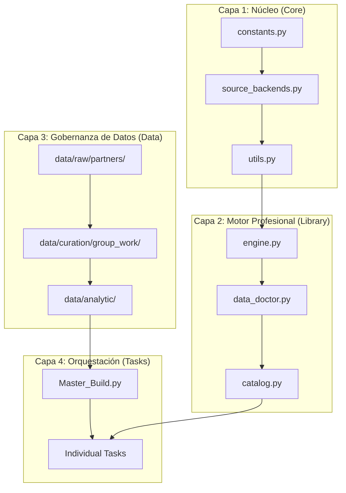

# 🏛️ CIE - Centro de Investigación Econométrica 2026

## Econometría Aplicada (Ciclo 7) - Universidad Nacional de Loja

El **Centro de Investigación Econométrica (CIE)** es una infraestructura de ingeniería de datos y laboratorio de análisis científico diseñado para la producción de investigación reproducible, auditable y de alta precisión técnica. 

Este ecosistema integra flujos de datos automatizados con metodologías de **Auditoría Forense de Datos**, permitiendo una separación absoluta entre la lógica del motor econométrico y la definición declarativa de variables.

---

## 📜 Filosofía de Ingeniería

Nuestra operatividad se rige por tres principios innegociables:

1.  **Forensic Econometric Audit**: Cada punto de dato es tratado como evidencia. El sistema valida la integridad de las series antes de permitir cualquier estimación, detectando inconsistencias entre fuentes o años perdidos de forma proactiva.
2.  **Agnostic Ingestion Intelligence**: Los investigadores no se preocupan por formatos (CSV, Excel o Parquet). El motor infiere y optimiza la carga de forma transparente.
3.  **Reproducibilidad Total**: Un investigador externo debe poder clonar el repo, correr `uv sync` y generar exactamente el mismo panel mediante una única línea de comando.

---

## 🏗️ Arquitectura de 4 Capas

El sistema se organiza de forma modular para permitir el escalamiento horizontal de investigaciones:



---

## 🔌 El Motor de Ingesta: Los 3 Pilares

La ingesta se centraliza en `SourceBackendRegistry`, que administra tres backends canónicos:

### 1. `world_bank` (API Nativa)
Conexión directa con los indicadores del Banco Mundial. Implementa un **Filtro de Integridad** que rechaza automáticamente series con discrepancias temporales internas.

### 2. `http_api` (Conectividad Dinámica)
Diseñado para consumir APIs de terceros mediante plantillas dinámicas. Soporta:
- Headers de autenticación vía variables de entorno.
- Inyección de parámetros (`start_year`, `end_year`).
- Navegación recursiva en payloads JSON (`records_path`).

### 3. `local_file` (Smart Loading Intelligence)
El pilar de mayor flexibilidad. Si un investigador deposita un archivo en la **Landing Zone**, el motor:
1.  **Smart Pathing**: Localiza el archivo basándose solo en el nombre, resolviendo rutas relativas.
2.  **Escalera de Inferencia**: Prueba extensiones y contenidos en orden de eficiencia: **Parquet → Excel → CSV/TSV**.
3.  **Delimite Discovery**: En archivos de texto, detecta automáticamente el separador (`,` , `;` , `|` o `\t`).

---

## 🩺 Validación Científica: Protocolo DataDoctor

Para garantizar que los datos crudos se conviertan en datos científicos, empleamos el **DataDoctor**:
- **Manifiestos de Curación**: El saneamiento (parches de valores, corrección de outliers) se define en archivos JSON, no en el código. Esto mantiene la trazabilidad de cada cambio.
- **Audit Logs**: Cada sesión de curación genera un log en `/logs/curation_audit.log` detallando: `Antiguo Valor -> Nuevo Valor (Fuente Citada)`.

---

## 🚀 Researcher Onboarding (Guía de Inicio)

### 1. Configuración del Laboratorio
El CIE utiliza `uv` para la gestión ultra-rápida de dependencias:
```bash
# Instalar dependencias y crear venv
uv sync

# Activar venv (Linux)
source .venv/bin/activate
```

### 2. Variables de Entorno
Es obligatorio exportar el `PYTHONPATH` para habilitar el motor interno:
```bash
export PYTHONPATH=src
```

### 3. Ejecución de Tareas
Cada unidad tiene un Master Build que secuencia la investigación:
```bash
# Ejecutar toda la Unidad 1
python src/orchestration/M01-U1-APE-Master_Build.py
```

---

## 📂 Estándares de la Landing Zone

Colaboraciones entre investigadores (Socios) deben seguir esta jerarquía para ser detectadas por los scripts de normalización:

```text
data/raw/partners/
├── [nombre_socio]/
│   ├── base_empleo_v1.xlsx
│   └── datos_ambiente.csv
```

> [!IMPORTANT]
> **Nomenclatura**: Las tareas deben nombrarse siguiendo el estándar: `[Tarea]-[Unidad]-[Tipo]-[Tema].py` (Ej: `T01-U1-APE-Homicidios.py`).

---

## 🧪 Verificación de Calidad (QA)

Antes de cada commit, el investigador debe validar que el núcleo permanece estable:
```bash
python -m pytest
```

---
*Centro de Investigación Econométrica - Facultad Jurídica, Social y Administrativa. UNL.*
