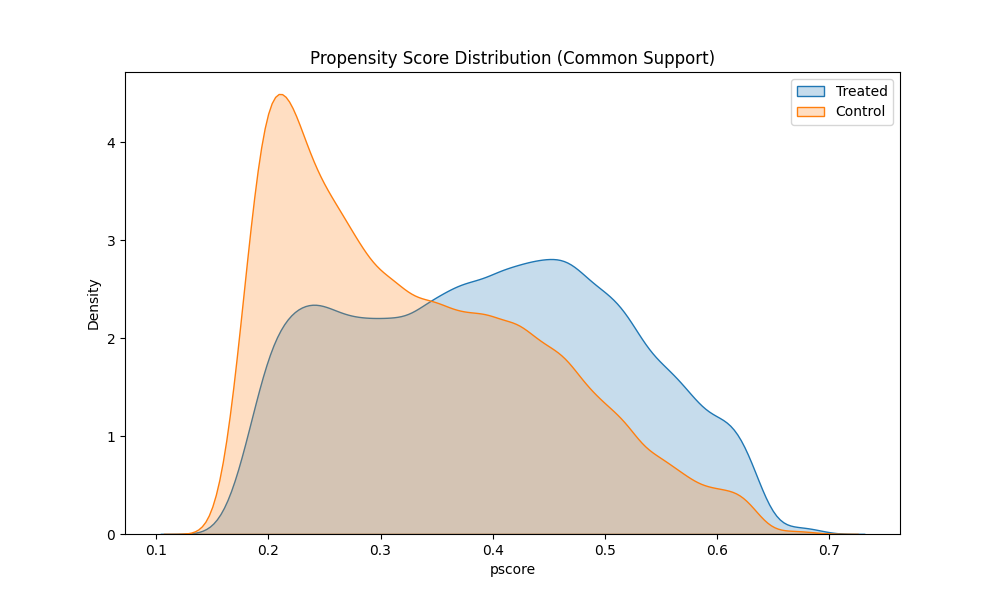
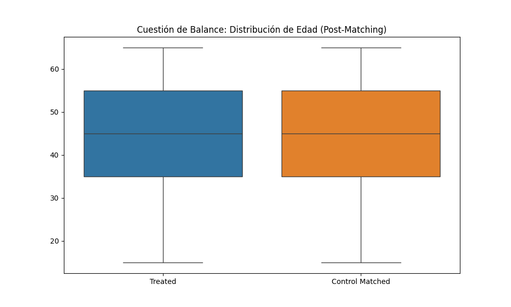

# Introducción

La evaluación de impacto de las políticas sociales es fundamental para determinar si los recursos públicos están cumpliendo sus objetivos de bienestar sin generar distorsiones negativas en el mercado laboral. En esta entrega, se analiza el **Bono de Desarrollo Humano (BDH)**, una transferencia monetaria condicionada dirigida a los hogares en situación de vulnerabilidad extrema en Ecuador [@bdh2024]. El objetivo central es identificar si la recepción de este subsidio correlaciona con la probabilidad de desempeñarse en el **sector informal**.

# Descripción de Variables

Para la estimación del modelo de impacto, se han seleccionado variables sociodemográficas y de control económico extraídas y depuradas de la ENEMDU 2023-2024 [@enemdu2024], filtrando a la Población Económicamente Activa (PEA) de entre 15 y 65 años.

| Variable | Tipo | Descripción | Fuente |
|:---|:---|:---|:---|
| `age` | Entero | Edad cronológica del encuestado (15-65 años) | ENEMDU |
| `sex` | Binaria | Género (1: Hombre; 0: Mujer) | ENEMDU |
| `edu` | Categórica | Nivel de instrucción formal alcanzado | ENEMDU |
| `hh_size` | Entero | Número de miembros que integran el hogar | ENEMDU |
| `area` | Binaria | Ubicación geográfica (1: Urbana; 0: Rural) | ENEMDU |
| `treated` | Binaria | Receptor del Bono de Desarrollo Humano (Tratamiento) | ENEMDU |
| `informal` | Binaria | Pertenencia al sector informal (Variable de Resultado) | Construcción Propia |

: Variables del Modelo de Evaluación de Impacto {#tbl-variables}

# Metodología

Debido a que el BDH no se asigna de forma aleatoria, se emplea el modelo de **Propensity Score Matching (PSM)** para corregir el sesgo de selección [@shmueli2010]. Se estima el *Propensity Score* mediante un modelo Logit, controlando por las variables descritas en la @tbl-variables. El emparejamiento se realiza mediante el algoritmo de **Vecino más Cercano (1:1)** con un *caliper* de $0.25\sigma$.

# Resultados

## Efecto Medio del Tratamiento (ATT)

Tras el matching, se obtuvo un **ATT (Average Treatment Effect on the Treated)** de **+39.32%**. Esto indica que los beneficiarios del BDH tienen una probabilidad significativamente mayor de trabajar en la informalidad que el grupo de control comparable.

## Soporte Común y Balance

En la @fig-pscore se presenta la distribución del P-Score, confirmando un soporte común adecuado. Asimismo, la @fig-balance muestra el balance de la variable edad tras el emparejamiento.

{#fig-pscore width=75% fig-align="center"}

{#fig-balance width=75% fig-align="center"}

# Conclusión

Los resultados sugieren que el BDH puede estar actuando como un desincentivo a la formalización laboral en el margen de la pobreza extrema, fenómeno conocido como la "Trampa de Informalidad". Se recomienda una revisión de las condicionalidades del programa para fomentar la transición hacia empleos de mayor productividad.

# Referencias

::: {#refs}
:::
