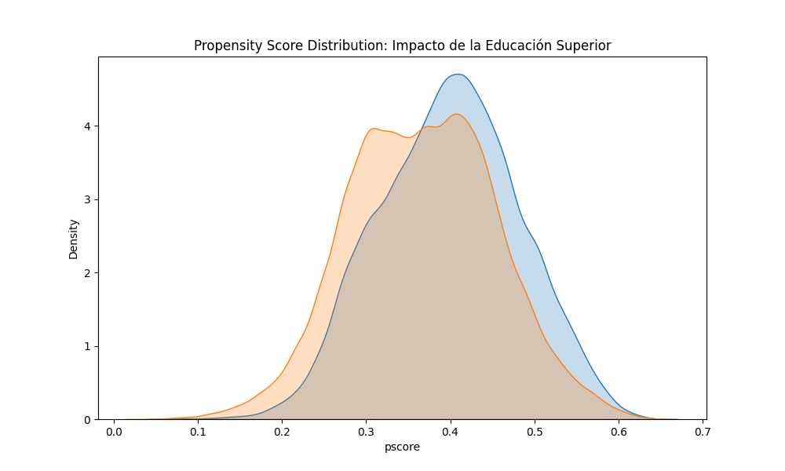
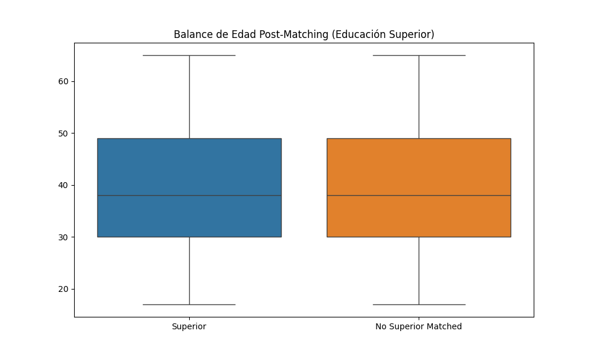

# Introducción

El presente estudio analiza los retornos a la educación en el mercado laboral ecuatoriano bajo un enfoque de evaluación de impacto. Se busca determinar si la obtención de un título de **Educación Superior** actúa como un motor de formalización laboral y mejora salarial, aislando el efecto del capital humano de otros factores sociodemográficos [@shmueli2010]. Utilizando microdatos de la ENEMDU 2024, se compara a individuos con educación superior frente a aquellos que solo alcanzaron niveles inferiores, aplicando técnicas de emparejamiento para asegurar la comparabilidad.

# Descripción de Variables

La base de datos se ha filtrado para incluir únicamente a la Población Económicamente Activa (PEA) de entre 15 y 65 años con registros completos de ingresos y sector de ocupación [@enemdu2024].

| Variable | Tipo | Descripción | Fuente |
|:---|:---|:---|:---|
| `age` | Entero | Edad cronológica (15-65 años) | ENEMDU |
| `sex` | Binaria | Género (1: Hombre; 0: Mujer) | ENEMDU |
| `hh_size` | Entero | Número de miembros en el hogar | ENEMDU |
| `area` | Binaria | Sector de residencia (1: Urbana; 0: Rural) | ENEMDU |
| `treated` | Binaria | Posee educación superior (Tratamiento) | ENEMDU |
| `formal` | Binaria | Empleo en el sector formal (Variable de Resultado 1) | ENEMDU |
| `income` | Continuo | Ingreso laboral mensual en USD (Variable de Resultado 2) | ENEMDU |

: Variables para el análisis de impacto educativo {#tbl-vars-edu}

# Metodología

Se emplea el algoritmo de **Propensity Score Matching (PSM)** con un modelo Logit para estimar la probabilidad de poseer educación superior. El emparejamiento se realiza mediante el método del **Vecino más Cercano (1:1)** con un *caliper* de $0.25\sigma$. Se analizan dos indicadores de desempeño laboral: la probabilidad de inserción formal y el nivel de ingresos.

# Resultados

## Efecto Medio del Tratamiento (ATT)

Los resultados confirman el alto valor del capital humano en el Ecuador. Los individuos con educación superior, comparados con sus pares de similar edad, sexo y ubicación geográfica, presentan:

1. **Formalidad:** Un incremento de **21.50 puntos porcentuales** en la probabilidad de trabajar en el sector formal.
2. **Ingresos:** Una ganancia salarial mensual promedio de **$313.63 USD**, lo que representa un retorno del **81.29%** respecto al grupo de control.

## Verificación de Soporte Común y Balance

La @fig-pscore-edu muestra una distribución de puntajes de propensión con un traslape significativo, validando el supuesto de soporte común. La @fig-balance-edu confirma que el emparejamiento logró equilibrar la variable edad entre grupos.

{#fig-pscore-edu width=75% fig-align="center"}

{#fig-balance-edu width=75% fig-align="center"}

# Conclusión

La educación superior no solo mejora el flujo de ingresos directos (efecto precio), sino que transforma la calidad del vínculo laboral (efecto estructura) al triplicar prácticamente la probabilidad de acceso a la seguridad social y la formalidad. Estos hallazgos subrayan la importancia de las políticas de acceso a la universidad como mecanismos eficaces de movilidad social y reducción de la precariedad laboral en Ecuador.

# Referencias

::: {#refs}
:::
