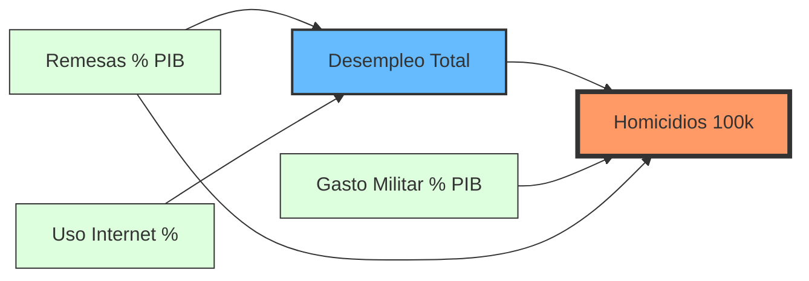

# Diagrama de Sendero (Path Diagram) - SEM Homicidios

Este diagrama representa la interdependencia de las variables en el Sistema de Ecuaciones Simultáneas de Homicidios para Ecuador.

## Instrucciones para Visio
1. Copie el código Mermaid anterior.
2. Utilice el sitio [Mermaid Live Editor](https://mermaid.live/) para previsualizar.
3. Exporte como **SVG**.
4. Importe el archivo SVG en Microsoft Visio para darle el formato final institucional.
