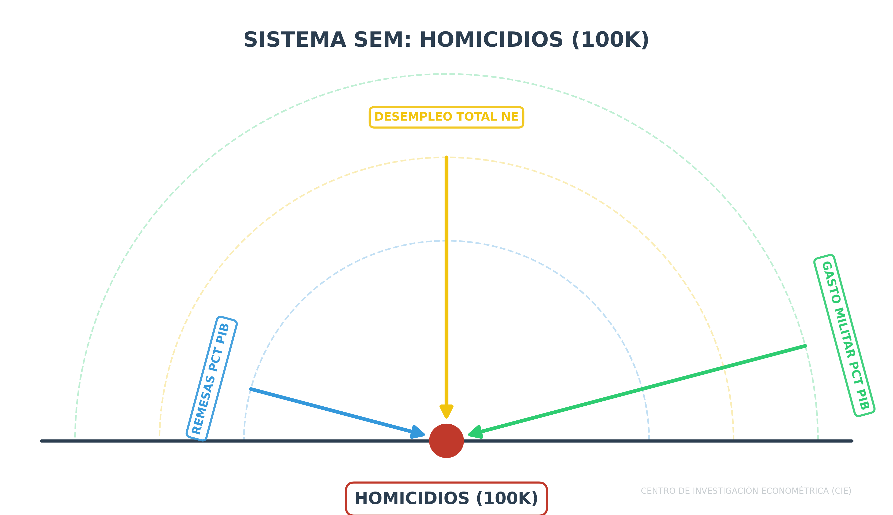
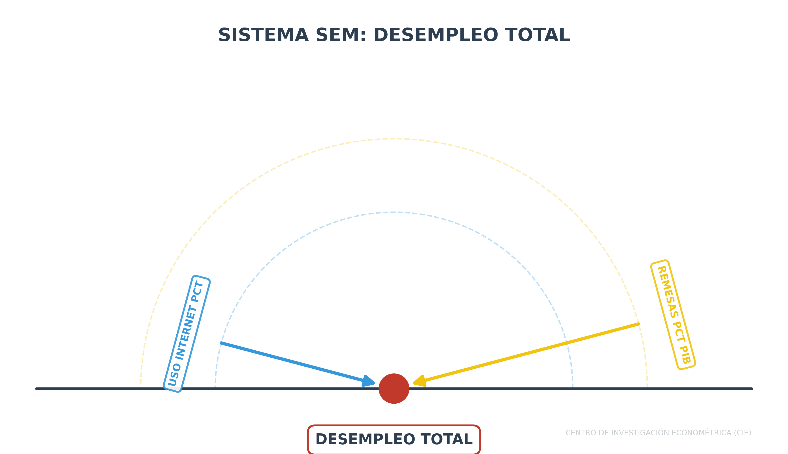
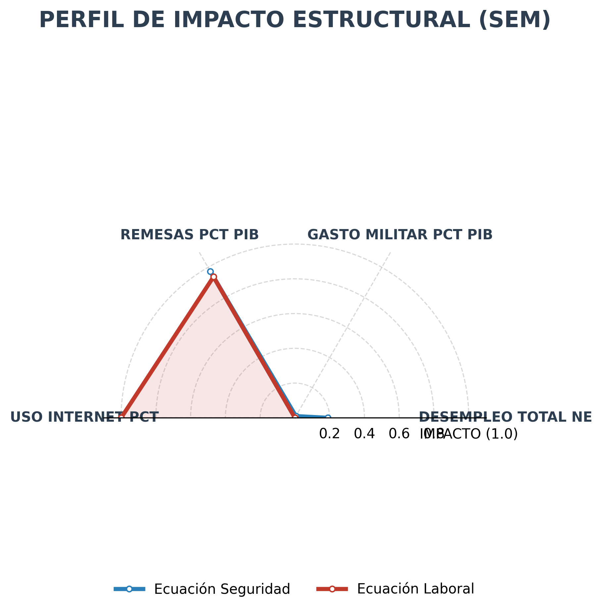

# 1. Introducción
El presente taller aborda la problemática de la violencia en Ecuador mediante un enfoque de **Ecuaciones Simultáneas (SEM)**. A diferencia de los modelos lineales simples, el SEM permite capturar la interdependencia entre variables donde una variable dependiente en una ecuación puede actuar como independiente en otra, resolviendo problemas de endogeneidad.

# 2. Especificación del Modelo
Se plantea un sistema de dos ecuaciones para capturar la dinámica entre seguridad y mercado laboral:

## Ecuación 1: Determinantes de la Violencia
$$Homicidios_{t} = \alpha_0 + \beta_1 Desempleo_{t} + \beta_2 GastoMilitar_{t} + \beta_3 Remesas_{t} + \epsilon_{1t}$$

{#fig-impact-homicidios width=100%}

## Ecuación 2: Dinámica del Mercado Laboral
$$Desempleo_{t} = \gamma_0 + \delta_1 Remesas_{t} + \delta_2 Internet_{t} + \epsilon_{2t}$$

{#fig-impact-laboral width=100%}

# 3. Diagrama Causal (Path Diagram)
El siguiente diagrama ilustra el flujo de causalidad y la estructura de simultaneidad del modelo. Este esquema es la base para la presentación en Visio.



# 4. Perfil de Impacto Estructural (Radar Chart)
A continuación se presenta la visualización de impacto basado en significancia. La escala (0-1) representa la fuerza de la asociación ($1 - p_{value}$). Variables cercanas al borde exterior indican una significancia crítica para el sistema.

{#fig-radar-impact width=80%}

# 5. Resultados Preliminares
Los datos han sido pre-procesados desde la fuente del Banco Mundial (WDI) y normalizados para el periodo 2004-2023. El modelo se estima mediante Mínimos Cuadrados en Dos Etapas (2SLS) para asegurar la consistencia de los estimadores ante la presencia de variables endógenas.

# 6. Conclusiones
La institucionalización de este taller en la arquitectura **CIE** permite la reproducibilidad total de los resultados y facilita la integración de nuevos controles económicos en futuras iteraciones del modelo.
