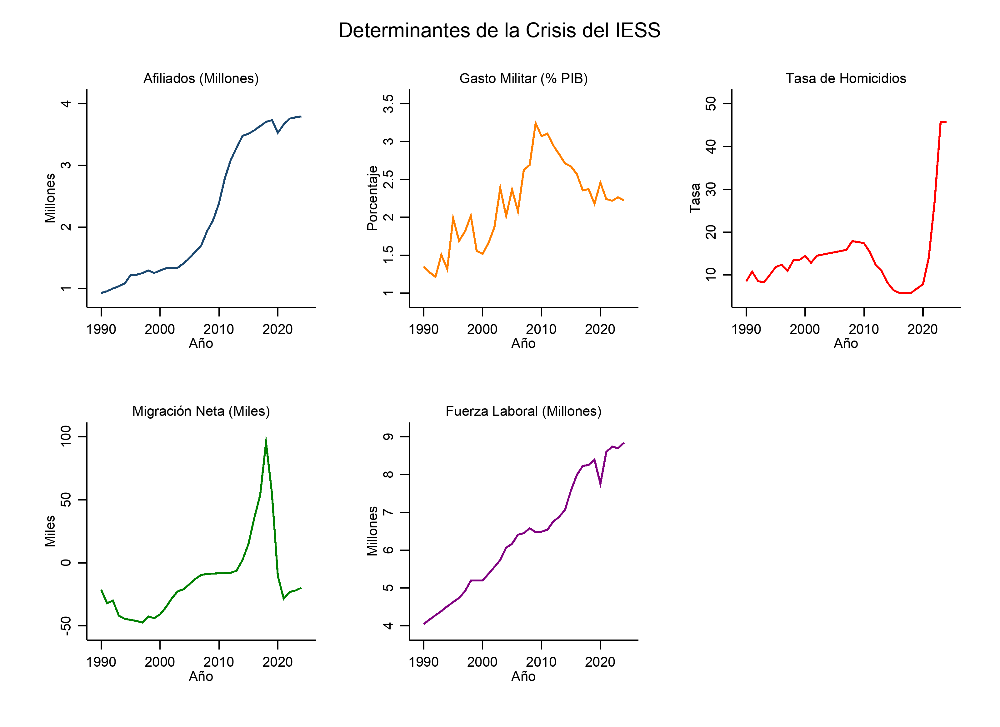

La evolución longitudinal de los determinantes permite identificar visualmente tendencias de largo plazo y posibles perturbaciones estructurales en el periodo de análisis. En la @fig-tendencias, las series han sido escaladas para facilitar la comparación analítica (Afiliados y Fuerza Laboral se reportan en millones; Migración en miles de personas).

{#fig-tendencias width=100%}

### Afiliados Activos Cotizantes del IESS ($\ln(AF)$)

La evolución de los afiliados activos cotizantes de la seguridad social revela un patrón bifásico condicionado por reformas normativas y choques macroeconómicos. Durante la década de 1990 y principios de la de 2000, la afiliación mantuvo un crecimiento inercial de baja densidad, limitado por la elevada informalidad estructural del mercado de trabajo y el impacto recesivo de la crisis financiera de 1999. El punto de inflexión estructural ocurre a partir de 2008. La promulgación de la Constitución de Montecristi y la posterior reforma penal de 2012 —que tipificó la no afiliación como delito— indujeron una expansión acelerada del padrón de contribuyentes, el cual pasó de 1.4 millones en 2007 a superar los 3.1 millones en 2015.

Este crecimiento normativo encontró sus límites en el estancamiento económico post-bonanza petrolera y el choque de la pandemia de COVID-19 en 2020. La contracción del empleo formal destruyó miles de cotizaciones activas, evidenciando la alta vulnerabilidad del sistema previsional ante la volatilidad del ciclo económico. La incapacidad de sostener el ritmo de afiliación en la última década ha acentuado el déficit actuarial del IESS. La relación de soporte se reduce de forma sostenida, amenazando la sostenibilidad financiera del fondo de pensiones a mediano plazo.

### Fuerza Laboral ($\ln(FL)$)

La fuerza laboral ecuatoriana presenta un crecimiento secular constante y demográficamente determinado a lo largo del periodo 1990-2024. Este incremento lineal refleja la transición demográfica del país, caracterizada por un bono demográfico donde la población en edad de trabajar alcanza su máxima proporción histórica. Asimismo, la incorporación progresiva de la mujer al mercado laboral ha acelerado la expansión de la oferta de mano de obra. Sin embargo, la estructura económica nacional ha sido incapaz de absorber productivamente este flujo continuo de mano de obra bajo condiciones de formalidad previsional.

La brecha persistente entre el crecimiento de la fuerza laboral y la generación de empleo adecuado constituye el núcleo de la crisis de sostenibilidad del IESS. Al no canalizarse la mano de obra hacia el sector formal, el excedente laboral se refugia en el subempleo y el trabajo informal, actividades exentas de contribución a la seguridad social. La trayectoria de esta variable demuestra que el incremento de la población activa, lejos de convertirse en un soporte dinámico del sistema previsional, se traduce en una presión social latente que profundiza el desequilibrio entre aportantes y beneficiarios.

### Gasto Militar ($GM$)

El gasto militar como porcentaje del PIB exhibe una trayectoria descendente de largo plazo, marcada por la transición de un estado de conflicto activo a uno de paz y posterior consolidación fiscal. En la primera mitad de la década de 1990, la prioridad fiscal de la defensa nacional fue elevada, alcanzando picos superiores al 3.2% del PIB en 1995 debido al conflicto bélico del Cenepa. Este esfuerzo militar representó un drenaje significativo de recursos públicos que limitó el espacio fiscal para la inversión social y el fortalecimiento de la red de seguridad social previsional.

La firma de la paz definitiva con el Perú en 1998 y la adopción de la dolarización en el año 2000 alteraron radicalmente este comportamiento. La pérdida de soberanía monetaria y la consecuente necesidad de disciplina presupuestaria impusieron una contracción del gasto de defensa, el cual se redujo y estabilizó en torno al 1.5% del PIB en las décadas subsiguientes. Esta reasignación de prioridades sectoriales liberó recursos fiscales en periodos de auge, pero la ausencia de un marco de estabilización sólido impidió que este dividendo de la paz se canalizara de forma óptima hacia reservas de estabilización o fondos de reserva para el sistema de seguridad social.

### Tasa de Homicidios ($\ln(HO)$)

La tasa de homicidios por cada 100,000 habitantes describe una evolución parabólica invertida y un posterior quiebre exponencial que redefine el panorama socioeconómico del país. Durante el decenio de 1990 y la primera década del siglo XXI, la violencia criminal se mantuvo en niveles moderadamente elevados pero estables. A partir de 2009, se inició un periodo de reducción sostenida que condujo a un mínimo histórico de 5.8 homicidios en 2017. Esta mejora transitoria en los índices de seguridad ciudadana coincidió con una fase de expansión del gasto social e inversión en infraestructura de seguridad.

Este escenario de relativa estabilidad colapsó abruptamente a partir de 2018, experimentando un ascenso vertical sin precedentes que posicionó al Ecuador entre las naciones más violentas del hemisferio, superando los 45 homicidios por cada 100,000 habitantes en 2023. Esta crisis de seguridad opera de forma directa sobre el deterioro del empleo formal y la sostenibilidad previsional. El incremento exponencial de la criminalidad y la extorsión destruye el tejido empresarial, inhibe la inversión privada directa y fuerza el cierre de unidades productivas, lo que se traduce directamente en una pérdida masiva de cotizantes activos del IESS.

### Migración Neta ($MI$)

Los flujos de migración neta registran las profundas perturbaciones macroeconómicas e institucionales que han forzado desplazamientos demográficos a gran escala. El hito más crítico del periodo corresponde a la crisis del feriado bancario y dolarización entre 1999 y 2001, periodo en el cual la migración neta alcanzó saldos altamente negativos, reflejando un éxodo masivo que diezmó la población en edad productiva activa del país. Esta pérdida de capital humano joven tuvo un efecto inmediato de descapitalización demográfica, restando aportantes potenciales al sistema previsional justo en el inicio de su fase de transición demográfica.

Tras un periodo de estabilización y retorno parcial durante el auge de las materias primas, la dinámica migratoria se ha reactivado en la última década bajo dos vectores contrapuestos. Por un lado, la inmigración regional de países vecinos amortiguó temporalmente la caída demográfica, aunque con escasa inserción en el sistema previsional formal. Por otro lado, la crisis multidimensional iniciada en 2019 ha detonado una segunda ola migratoria de ecuatorianos hacia el exterior. Este nuevo flujo de salida presiona doblemente al IESS al erosionar la base impositiva de cotizantes jóvenes y fragmentar los hogares, incrementando la dependencia socioeconómica de los adultos mayores rezagados.
