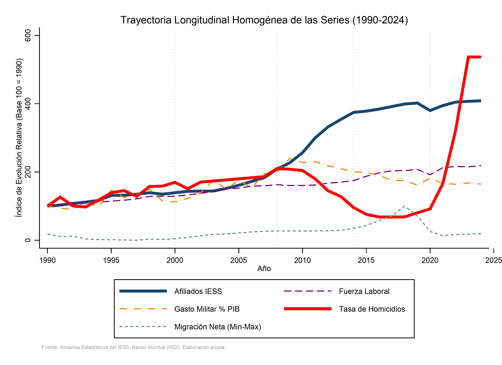

# Nota Técnica: Descriptivos, Raíz Unitaria (Zivot-Andrews) y VIF

Esta nota técnica agrupa las visualizaciones de tendencias estructurales, estadísticas descriptivas, y pruebas de multicolinealidad y estacionariedad ejecutadas sobre las series temporales de la crisis del IESS (1990-2024).

## 1. Evolución Temporal de Tendencias Estructurales

La evolución longitudinal de las variables de escala y control previsional muestra quiebres estructurales importantes en la dolarización (2000) y la reforma constitucional de 2008 (Afiliados y Fuerza Laboral en millones; Migración en miles):

{#fig-tendencias width=100%}

## 2. Estadísticos Descriptivos Completos

Resumen descriptivo de las 35 observaciones anuales integradas con base en el Banco Mundial e IESS:

| Variable | N | Media | Desv. Est. | Mín. | Máx. |
|:---|:---:|:---:|:---:|:---:|:---:|
| Log Afiliados ($\ln(AF)$) | 35 | 14.4970 | 0.5160 | 13.7420 | 15.1493 |
| Gasto Militar ($GM$) | 35 | 2.1833 | 0.5560 | 1.2133 | 3.2432 |
| Migración Neta ($MI$) | 35 | -13606.2 | 31691.4 | -47287.0 | 95482.0 |
| Log Tasa Homicidios ($\ln(HO)$) | 35 | 2.5222 | 0.4908 | 1.7557 | 3.8226 |
| Log Fuerza Laboral ($\ln(FL)$) | 35 | 15.6394 | 0.2402 | 15.2127 | 15.9950 |

: Estadísticos Descriptivos de las Variables (1990-2024) {#tbl-resumen}

## 3. Factor de Inflación de la Varianza (VIF)

Para asegurar la validez paramétrica del modelo base y descartar multicolinealidad severa, se calculó el VIF sobre los regresores independientes:

| Variable | VIF | 1/VIF |
| :--- | :---: | :---: |
| Migración Neta ($MI$) | 3.76 | 0.2658 |
| Log Fuerza Laboral ($\ln(FL)$) | 3.60 | 0.2780 |
| Log Tasa Homicidios ($\ln(HO)$) | 2.31 | 0.4323 |
| Gasto Militar ($GM$) | 1.83 | 0.5474 |
| **Promedio VIF** | **2.87** | |

: Factor de Inflación de la Varianza (VIF) {#tbl-vif}

*Interpretación*: Un VIF promedio de 2.87 y valores individuales inferiores al umbral crítico de 5.0 confirman la ausencia de colinealidad grave, permitiendo estimar de forma conjunta todos los regresores explicativos.

## 4. Pruebas de Raíz Unitaria con Quiebre Estructural (Zivot-Andrews)

Debido a las perturbaciones crítico-estructurales (como el feriado bancario en 1999 o la reforma previsional penal de 2012), se empleó la prueba de Zivot-Andrews (ZA) para determinar la estacionariedad de manera endógena permitiendo un cambio estructural único en la tendencia, intercepto o ambos:

```{=latex}
\begin{center}
\small
\begin{tabular}{lccccccccc}
\hline \hline
 & \multicolumn{4}{c}{Estadísticos de Prueba (Niveles)} & \multicolumn{4}{c}{Estadísticos de Prueba (Primeras Dif.)} & \multirow{2}{*}{I(d)} \\
\cline{2-5} \cline{6-9}
Variable & (ADF) & (PP) & (ZA) & Quiebre & (ADF) & (PP) & (ZA) & Quiebre & \\
\hline
$\ln(AF)$ & -1.529 & -1.367 & -2.707 & 2010 & -1.936 & -2.963 & -4.578 & 2008 & I(1) \\
GM        & -0.863 & -1.566 & -4.458 & 2008 & -3.817* & -8.747*** & -10.371*** & 2011 & I(1) \\
MI        & -3.269 & -2.220 & -5.665*** & 2016 & -4.347** & -3.544* & -9.270*** & 2019 & I(0) \\
$\ln(HO)$ & -2.264 & -1.154 & -3.791 & 1998 & -3.824** & -3.128 & -5.109** & 2011 & I(1) \\
$\ln(FL)$ & -2.423 & -2.785 & -3.657 & 2009 & -4.212** & -6.756*** & -7.020*** & 2015 & I(1) \\
\hline \hline 
\multicolumn{10}{p{15cm}}{\footnotesize \textit{Nota: * p $<$ 0.1, ** p $<$ 0.05, *** p $<$ 0.01. Los valores críticos de la prueba de Zivot-Andrews (ZA) con quiebre estructural en intercepto y tendencia al 1\%, 5\% y 10\% de significancia son -5.57, -5.08 y -4.82, respectivamente. Las columnas (ADF) y (PP) muestran los estadísticos de las pruebas clásicas de Dickey-Fuller Aumentado y Phillips-Perron. Los años denotan los puntos de quiebre estructurales endógenos calculados de manera óptima en cada serie temporal.*}}
\end{tabular}
\end{center}
```

*Interpretación*: Los resultados confirman que el sistema de variables explicativas combina variables de orden de integración mixto ($I(0)$ e $I(1)$), lo que justifica metodológicamente la cointegración dinámica ARDL de Pesaran et al. (2001).
