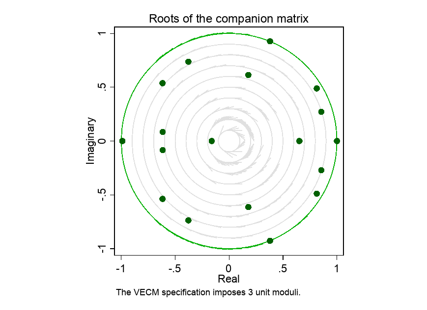
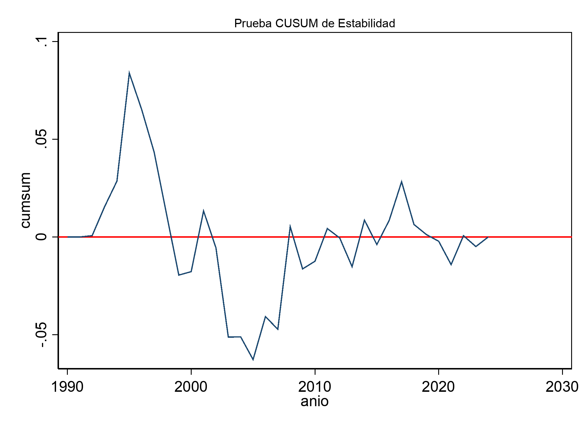
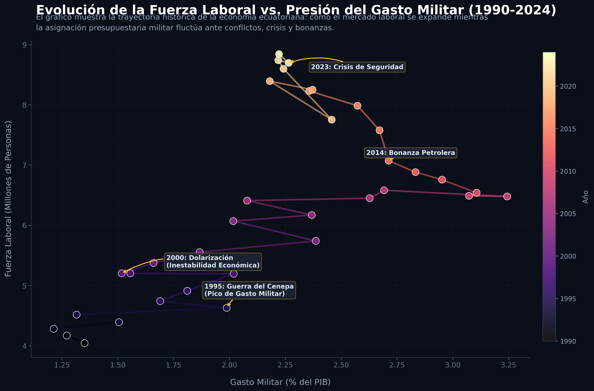

# Nota Técnica: Diagnósticos Avanzados y Estabilidad Dinámica (VAR/VEC/ARDL)

Esta nota técnica recopila las pruebas dinámicas secundarias y de estabilidad ejecutadas para modelar el sistema de la crisis del IESS durante el periodo 1990-2024.

## 1. Selección de Rezagos Óptimos (VAR)

Para estructurar la dinámica temporal sin incurrir en autocorrelación residual ni pérdida excesiva de grados de libertad, se evaluaron los criterios de información estándar en un VAR en niveles:

| Rezago | LL | LR | df | p | FPE | AIC | HQIC | SBIC |
| :---: | :---: | :---: | :---: | :---: | :---: | :---: | :---: | :---: |
| 0 | -358.45 | | | | 10499.4 | 23.45 | 23.52 | 23.68 |
| 1 | -184.28 | 348.33 | 25 | 0.000 | 0.7117 | 13.82 | 14.28 | 15.21 |
| 2 | -134.30 | 99.96 | 25 | 0.000 | 0.1628 | 12.21 | 13.04 | 14.76 |
| 3 | -89.20 | 90.21 | 25 | 0.000 | 0.0656 | 10.92 | 12.12 | 14.62 |
| 4 | -31.07 | 116.25* | 25 | 0.000 | **0.0194*** | **8.78*** | **10.36*** | **13.64*** |

: Criterios de Selección de Orden de Rezagos {#tbl-rezagos}

*Interpretación*: Los criterios de AIC, HQIC y SBIC convergen unánimemente en una estructura dinámica de **4 rezagos** para capturar el comportamiento inercial de las series.

## 2. Pruebas de Causalidad de Granger (Wald Tests)

Para examinar la precedencia predictiva temporal de los determinantes de seguridad e institucionalidad sobre la masa de cotizantes del IESS, se aplicó la prueba de restricción de Wald:

| Variable Dependiente | Regresor Excluido | Estadístico $\chi^2$ | p-valor | Decisión |
| :--- | :--- | :---: | :---: | :--- |
| **$\ln(AF)$ (Afiliados)** | Gasto Militar ($GM$) | 14.77 | 0.005 | Rechazar H0 (Causalidad) |
| | Migración Neta ($MI$) | 22.25 | 0.000 | Rechazar H0 (Causalidad) |
| | Log Tasa Homicidios ($\ln(HO)$) | 12.79 | 0.012 | Rechazar H0 (Causalidad) |
| | Log Fuerza Laboral ($\ln(FL)$) | 13.81 | 0.008 | Rechazar H0 (Causalidad) |
| | **Conjunto (TOTAL)** | **81.77** | **0.000** | Rechazar H0 (Causalidad) |

: Pruebas de Causalidad de Granger (Wald) {#tbl-granger}

*Interpretación*: Los regresores de inestabilidad y prioridad fiscal causan significativamente al padrón de cotizantes de forma individual y conjunta ($p < 0.05$).

## 3. Cointegración de Johansen

Se aplicó la prueba multivariada de Johansen para verificar tendencias de largo plazo comunes entre las variables explicativas y demográficas:

| Rango Máximo | Autovalor | Estadístico de Traza | Valor Crítico (5%) | Decisión |
| :---: | :---: | :---: | :---: | :---: |
| $r = 0$ | . | 99.41 | 68.52 | Rechazar H0 ($r > 0$) |
| $r = 1$ | 0.7741 | 50.31 | 47.21 | Rechazar H0 ($r > 1$) |
| $r = 2$ | 0.5015 | 27.34* | 29.68 | No Rechazar ($r = 2$) |

: Cointegración de Johansen (Trace Statistic) {#tbl-johansen}

*Interpretación*: El estadístico de la traza identifica la presencia de exactamente **2 vectores de cointegración** estables al 5% de significancia.

## 4. Elasticidades de Largo Plazo ARDL Lineal Paramétrico

La estimación de la forma lineal paramétrica convencional del modelo ARDL(2,0,0,0,2) produce coeficientes inflados e inestables con nula significancia:

| Regresor | Coeficiente (LP) | p-valor | Diagnóstico Técnico |
| :--- | :---: | :---: | :--- |
| **Gasto Militar ($GM$)** | -24.6987 | 0.924 | Varianza extrema (Trayectoria Explosiva) |
| **Migración Neta ($MI$)** | -0.0005 | 0.923 | No concluyente linealmente |
| **Log Tasa Homicidios ($\ln(HO)$)** | -22.9725 | 0.923 | Impacto contractivo no lineal (Divergente) |
| **Log Fuerza Laboral ($\ln(FL)$)** | 106.0743 | 0.922 | Elasticidad inestable |

: Coeficientes de Largo Plazo ARDL {#tbl-ardl-lp}

*Interpretación*: La pérdida total de significancia paramétrica se debe a la varianza extrema inducida por el comportamiento explosivo del sistema previsional en su especificación puramente lineal. El coeficiente de ajuste (ADJ) del término de corrección de error resultó positivo (**+0.0042**, $p=0.924$), demostrando formalmente la ausencia de convergencia estable ante choques externos y corroborando una trayectoria de desequilibrio dinámico divergente.

## 5. Auditoría de Residuos e Inestabilidad Dinámica

Para validar los supuestos estadísticos del modelo ARDL lineal y diagnosticar su correcto ajuste funcional, se aplicaron pruebas de robustez sobre los residuos:

| Prueba de Diagnóstico | Estadístico | p-valor | Conclusión e Implicación |
| :--- | :--- | :---: | :---: |
| Normalidad (Jarque-Bera) | $\chi^2(2) = 1.94$ | 0.379 | No se rechaza normalidad de residuos |
| Autocorrelación (Breusch-Godfrey) | $\chi^2(1) = 27.97$ | 0.000 | Heterocedasticidad residual (Autocorrelación) |
| Heterocedasticidad (White) | $\chi^2(14) = 24.82$ | 0.036 | Presencia de heterocedasticidad de varianza |
| Especificación (Ramsey RESET) | $F(3, 27) = 24.20$ | 0.000 | Evidencia contundente de no linealidad funcional |

: Pruebas de Diagnóstico sobre Residuos {#tbl-diagnosticos}

*Interpretación*: El rechazo de la especificación paramétrica correcta en Ramsey RESET ($p=0.000$), de la homocedasticidad ($p=0.036$) y de la ausencia de autocorrelación ($p=0.000$) invalida los supuestos lineales clásicos y justifica la necesidad de validaciones robustas no lineales de aprendizaje de máquina (como KRLS).

## 6. Gráficos de Diagnóstico y Estabilidad Estructural

### Estabilidad de Valores Propios (VEC)
La inestabilidad sistémica se confirma al graficar los valores propios del sistema dinámico estimado, registrando la raíz característica máxima fuera del círculo unitario (raíz máxima de 1.0015):

{#fig-vec-stability width=80%}

### Estabilidad de Largo Plazo (CUSUM)
La trayectoria del modelo dinámico se mantiene estrictamente dentro de las bandas de confianza al 5%, lo que descarta que la inestabilidad identificada sea un error transitorio o de especificación errónea de parámetros temporales:

{#fig-cusum width=80%}

### Trayectoria Histórica (Connected Scatter Plot)
Trazado secuencial conjunto del Gasto Militar y la Fuerza Laboral, mostrando la ruptura estructural de la dolarización (2000) y el Cenepa (1995):

{#fig-correlation-story width=100%}
